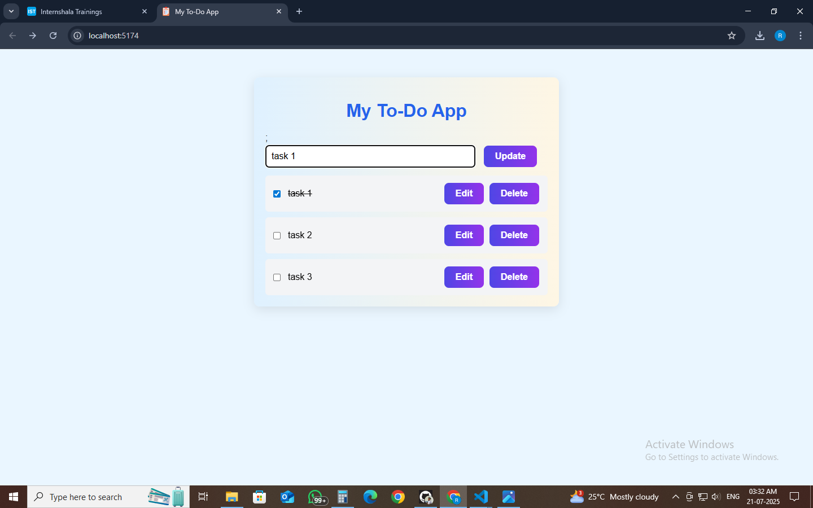

#  To-Do List App

A simple and beautiful **To-Do List application** built using **React** and **Vite**.  
This app allows users to **add**, **edit**, **complete**, and **delete** tasks with a clean UI and gradient-styled buttons.

---

##  Features

-  Add new tasks  
-  Edit existing tasks  
-  Delete tasks  
-  Mark tasks as completed  
-  Gradient buttons with hover effects  
-  Built using functional components, props, and state  
-  Responsive design with simple CSS (no blur!)


---

## Screenshots

###  Home Page



> The app allows adding, editing, completing, and deleting tasks in a clean and responsive interface.


##  Tech Stack

| Technology  | Description              |
|-------------|--------------------------|
| React       | JavaScript UI Library    |
| Vite        | Fast development build tool |
| CSS         | Custom styling           |
| Git & GitHub | Version control + hosting |

---

##  Installation & Setup

###  Clone the Repository

```bash
git clone https://github.com/raj-thakur/todo-app.git
cd todo-app
